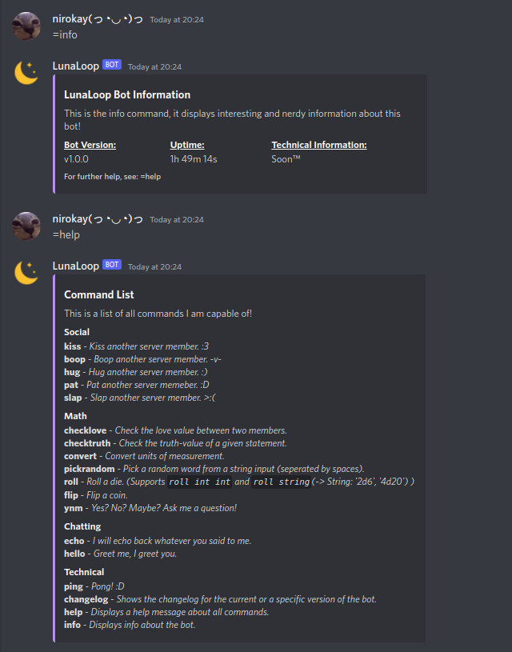
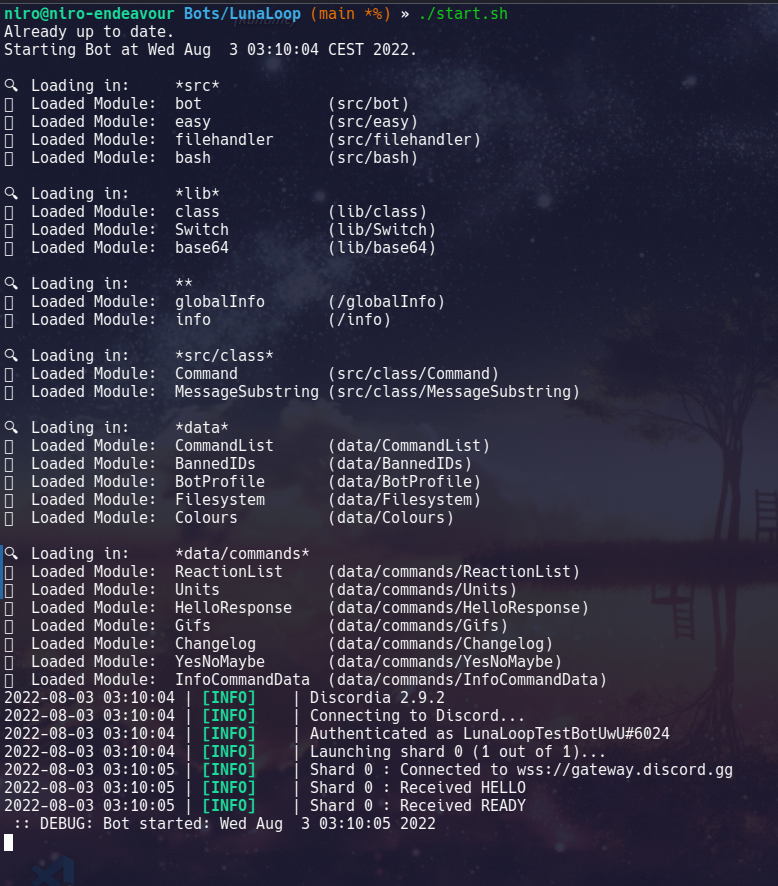

# LunaLoop Discord Bot

## About

LunaLoop is a discord general-purpose bot written in Lua, using the [discordia](https://github.com/SinisterRectus/Discordia) discord-api.

## Installation and Running

Simply clone this repository and run the `start.sh` file from your terminal. Upon first run, you will be prompted to insert your bot information (such as id, token). This will then be saved to a file called `info.lua`. This file will look something like this:

```lua
info = {
    name = 'LunaLoop',
    version = 'v0.1',
    prefix = '=',
    id = '0123456789',
    token = 'very_secret_token',
    invite = 'https://discord.com/',
    repository = 'https://github.com/NiroUwU/LunaLoop'
}

return info
```

## Screenshots

 

## Dependancies

Included in this Repository:

+ [Discordia](https://github.com/SinisterRectus/Discordia)

Required on your system:

+ bash

+ git

+ curl

+ [Luvit runtime](https://github.com/luvit/luvit)
  
  + Lua 5.2 (comes bundled with Luvit)

## Supported Systems

This bot has been tested on the following systems:

+ Arch Linux (x86_64 architecture)

+ Rasbian Linux (armv7l architecture)

If you have problems compiling the luvit runtime, check out [pre-built luvit binaries](https://github.com/truemedian/luvit-bin) (at your own risk, as it is not an official luvit repository!)
